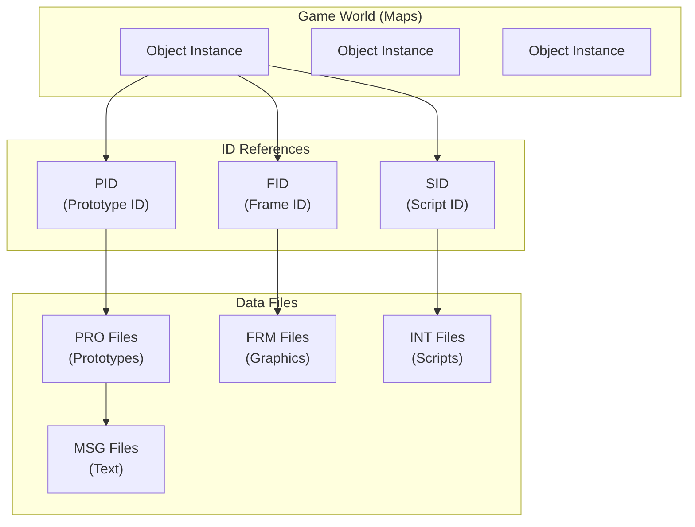
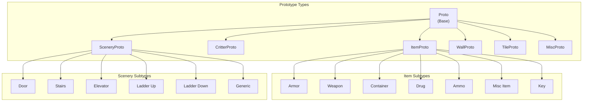
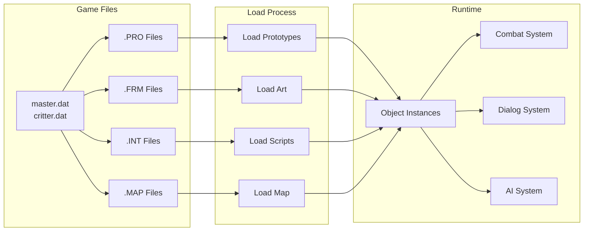
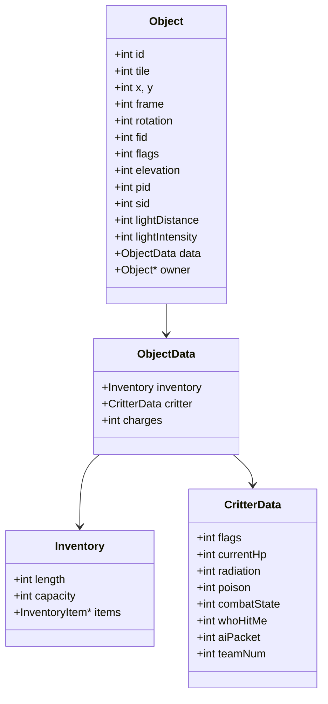
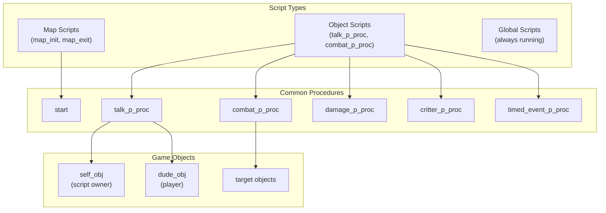

# Engine Architecture

This page provides a high-level overview of how Fallout 2's engine organizes game data and the relationships between different systems.

## Core Concepts



### Objects

**Objects** are instances that exist in the game world on maps. Each object has:

- **Position**: tile hex, x/y offset, elevation (0-2)
- **State**: current frame, rotation, flags
- **References**: PID, FID, SID linking to data files
- **Instance data**: current HP, inventory, combat state

### Prototype ID (PID)

The **PID** encodes both the object type and prototype number:

```
PID = (type << 24) | proto_number

Example: PID 0x01000004
  Type: 0x01 (Critter)
  Proto: 0x000004 (4th critter prototype)
```

### Frame ID (FID)

The **FID** identifies which graphics to display. Objects can override their prototype's default FID (e.g., when wearing different armor).

### Script ID (SID)

The **SID** links to compiled SSL scripts (`.INT` files) that control behavior.

## Prototype Hierarchy



## Object Types

| Type ID | Name | Description | Proto Directory |
|---------|------|-------------|-----------------|
| `0x00` | Item | Weapons, armor, consumables | `proto/items/` |
| `0x01` | Critter | NPCs, creatures, player | `proto/critters/` |
| `0x02` | Scenery | Doors, stairs, decorations | `proto/scenery/` |
| `0x03` | Wall | Blocking terrain features | `proto/walls/` |
| `0x04` | Tile | Floor and roof tiles | `proto/tiles/` |
| `0x05` | Misc | Exit grids, special objects | `proto/misc/` |

## Data Flow



## Object Instance Structure

When an object exists in the game world, it contains:



## Script Integration

Scripts interact with objects through the SSL scripting language:



## ID Encoding Summary

| ID Type | Encoding | Example | File Location |
|---------|----------|---------|---------------|
| **PID** | `(type << 24) \| number` | `0x01000004` = Critter #4 | `proto/critters/` |
| **FID** | `(type << 24) \| anim \| id` | Complex encoding | `art/critters/`, etc. |
| **SID** | Script table index | `0x00000001` | `scripts/` |
| **MID** | Message table index | Plain integer | `text/english/` |

## See Also

- [PRO File Format](./pro) - Detailed prototype file structure
- [SSL Overview](/ssl/overview) - Scripting language documentation
- [Function Reference](/ssl/functions) - Available script functions
